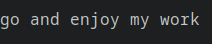

# goand

tired of makeing decions and its impossible to choose. look no farther. the goand(tm) chooses you what to do using complete randomess


it is just a small project made in Rust. I am learning rust so this will offically be my first working project with rust... with some googling ofc

---
## install 

give `./goand` permissions to run 

```bash
sudo chmod +x ./goand
```

move goand to `/bin/goand`

```sh
sudo mv ./goand /bin/goand
```
---

## how


type in the terminal

```sh
goand "sleep restfully" "play some games"
```

### it will choose for you. **you must have two options**

if you are getting this:

```sh
$ goand "sleep"
thread 'main' panicked at 'Option two arguement is missing', src/main.rs:14:22
note: run with `RUST_BACKTRACE=1` environment variable to display a backtrace
```
or 
```sh
$ goand
thread 'main' panicked at 'Option one arguement is missing', src/main.rs:13:22
note: run with `RUST_BACKTRACE=1` environment variable to display a backtrace
```

**this means you do not have all the NEEDED arguments**

---

## how

it has one random number then another 

so two random numbers

one changes every revultions the other always stays the same (intill "goand" gets ran again...)

it will loop checking of num 1 equals num 2

this keeps track of how many times it loops, intill it matches 

once it matches the loop number (*key*) will be checked if it is even if so it will choose the first option else the 2nd

---



O'Brien.. March 8th 2023